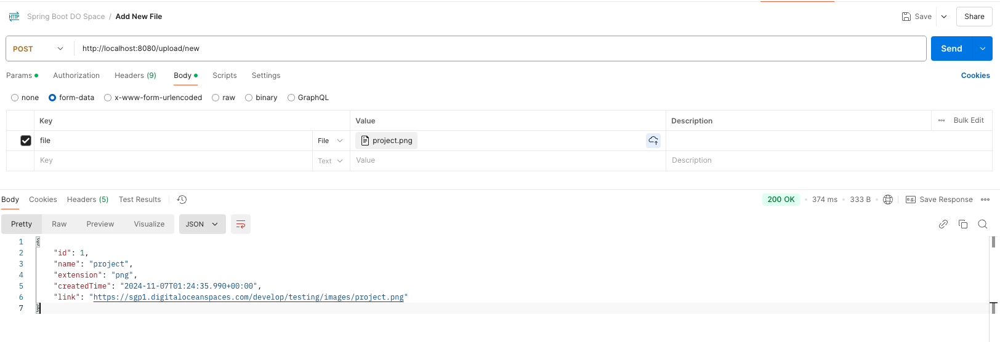
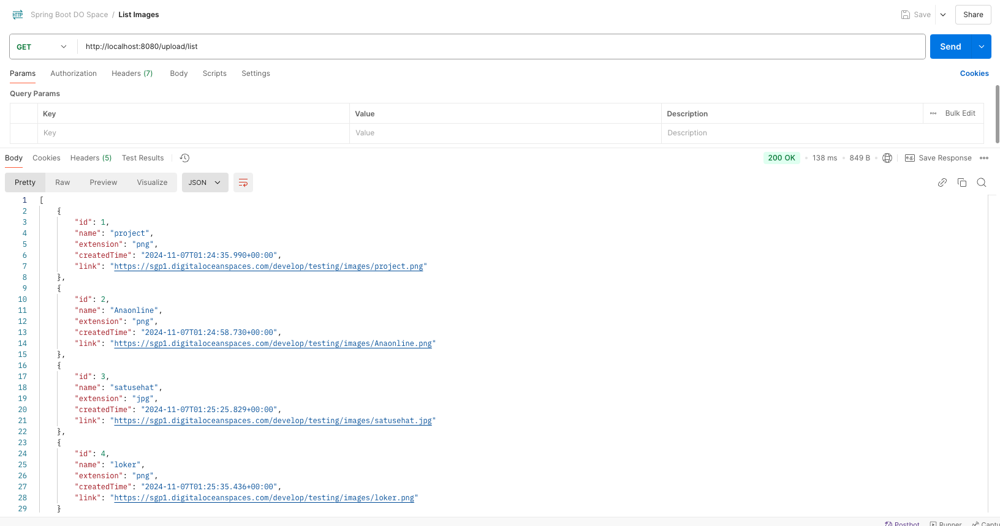
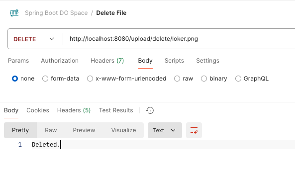

# spring-boot-digital-ocean-space

### Things todo list

1. Clone this repository: `git clone https://github.com/hendisantika/spring-boot-digital-ocean-space.git`
2. Navigate to the folder: `cd spring-boot-digital-ocean-space`
3. Change DO Space Credentials in `application.yml`
4. Run the application: `mvn clean spring-boot:run`
5. Open POSTMAN App then import POSTMAN collection file
6. Hit the API

### Image Screen shot

Upload new Image

List All images

Delete Image by filename

